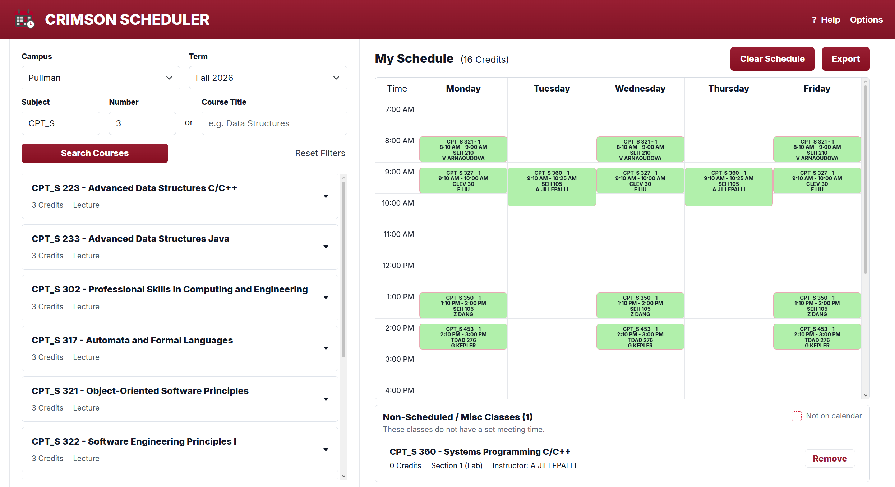
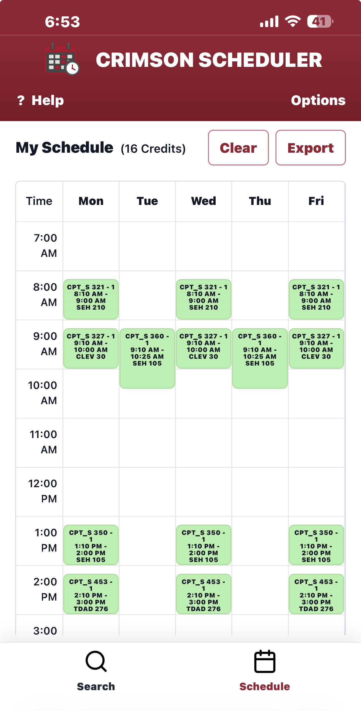
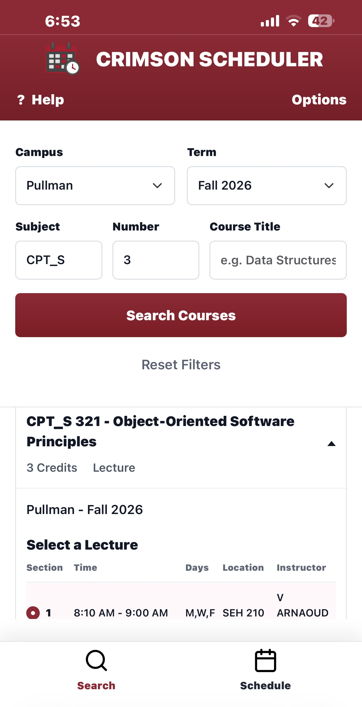

# Crimson Scheduler

Crimson Scheduler is a WSU-focused schedule builder that helps students search course offerings and assemble a weekly class schedule. It retrieves publicly accessible course schedule data from WSU's schedule API endpoints, stores course information in a Django database, and provides a responsive calendar UI for desktop and mobile.

### Why did I make this?

I've found it to be somewhat annoying to plan out classes using the current scheduling systems WSU has in place. I've also seen that frustration echoed across other people on online forums as well. As such, I decided to make this webapp to make the process of planning out a semester of classes MUCH easier. 

##### What about other sites like Coursicle?

Crimson Scheduler occupies a similar space to services such as Coursicle, but is specifically designed with WSU students in mind. The goal is to provide a straightforward, WSU-focused experience without requiring students to manually enter course information when it isn't available through a third-party service.

Simply put, you can think of Crimson Scheduler as Coursicle just for us WSU students :\)



## Current Features

- Search WSU courses by campus, term, subject, course number, or course title.
- View course sections with credits, meeting days, times, location, and instructor.
- Choose lecture sections and required lab sections together when a course includes a lab.
- Build a visual weekly schedule from selected sections.
- Preview sections on the calendar before adding them.
- Detect overlapping course times and highlight conflicts.
- Track total selected credits.
- Separate arranged, TBA, online, or otherwise unscheduled courses into a misc list.
- Remove individual courses or clear the full schedule.
- Export the selected schedule as JSON.
- Persist the in-browser schedule for 30 days with a cookie.
- Customize the display with options for 24-hour time, hidden weekends, instructor labels, and section labels.
- Use a mobile layout with separate Search and Schedule tabs.

## Mobile UI

| Schedule | Search |
| --- | --- |
|  |  |

## Tech Stack

- Python
- Django
- PostgreSQL
- WSU schedule API endpoints for data collection
- HTMX for course search partial updates
- Bootstrap for interactive UI pieces
- JavaScript for schedule rendering, conflict highlighting, cookies, export, and mobile navigation

## Project Structure

```text
.
|-- dataCollection/         # WSU API data loading and transformation helpers
|   |-- dataHandler/
|   |   |-- scraper.py          # Legacy; unused
|-- readme-images/          # README screenshots
|-- web/                    # Django project
|   |-- classes/            # Course models, views, templates, static assets
|   `-- web/                # Django settings and root URL config
|-- main.py                 # Imports WSU schedule data into the configured DB
|-- requirements.txt        # Python dependencies for local setup
`-- README.md
```

## Local Setup

Create and activate a virtual environment:

```powershell
python -m venv venv
.\venv\Scripts\Activate.ps1
```

Install dependencies:

```powershell
pip install -r requirements.txt
```

Create a `.env` file in the repo root with your Django database settings:

```env
DB_ENGINE=django.db.backends.postgresql
DB_NAME=your_database_name
DB_USER=your_database_user
DB_PWD=your_database_password
DB_HOST=localhost
DB_PORT=5432
```

For SQLite development, use Django's SQLite backend and a local database path:

```env
DB_ENGINE=django.db.backends.sqlite3
DB_NAME=db.sqlite3
DB_USER=
DB_PWD=
DB_HOST=
DB_PORT=
```

Run migrations:

```powershell
cd web
python manage.py migrate
```

Load WSU schedule data:

```powershell
cd ..
python main.py
```

Start the development server:

```powershell
cd web
python manage.py runserver
```

Then open `http://127.0.0.1:8000/`.

## Data Collection

The original scraper approach has been replaced with direct WSU API calls. `main.py` initializes Django, requests campus, term, subject, course, and section data from WSU schedule endpoints, and upserts the results into the configured database.

The importer currently stores:

- Campuses
- Semesters
- Subjects/topics
- Courses
- Sections
- Lecture/lab metadata
- Enrollment totals
- Meeting days, times, locations, and instructors

WSU schedule data is cached locally in PostgreSQL so normal user searches do not require repeated requests to WSU endpoints. The importer can be run separately to refresh the cached dataset.

## Notes

- The visible schedule UI currently persists selected sections in a browser cookie.
- Some older scraper code remains in `dataCollection/dataHandler/scraper.py`, but the current path uses API-based collection.

## Future Work

The core scheduling experience is complete. Future work is focused on deployment, additional course metadata, export options, and stretch-goals based on potential user feedback.

- [ ] Deploy Crimson Scheduler to a public domain for broader access.
- [ ] Improve export options beyond JSON.
- [ ] Explore professor ratings by either linking instructor names to their RMP profiles, where available, or developing a user-submitted rating system.
- [ ] Allow webapp to be updated on a frequency that allows users to view seating counts.
- [ ] Add prerequisite or course-description metadata if reliable WSU data becomes available OR construct a dependency graph that helps visualize how courses relate to each other.
- [ ] Implement daily path generation to visualize a potential walking route between classes based on their locations.


### Disclaimers

Crimson Scheduler is an independent, third-party project and is not affiliated with, endorsed by, sponsored by, or otherwise officially associated with Washington State University (WSU).

Crimson Scheduler is a planning tool, not a registration system. Course availability, meeting times, instructors, locations, and other information should be verified through official WSU resources before registration.

Course information may be delayed, incomplete, or outdated between data refreshes.

Crimson Scheduler does not currently require user accounts. The app stores selected course sections and display preferences in a browser cookie to restore schedules between visits. No PII is intentionally collected by the application.

## AI Disclosure

The majority (not all) of this README.md was written with the guidance of AI, but ultimately reviewed by me (a human, I swear). If there are any questions related to the project, please feel free to reach out to me using the links in my profile. Thanks!

## License

[MIT](/LICENSE.md)
