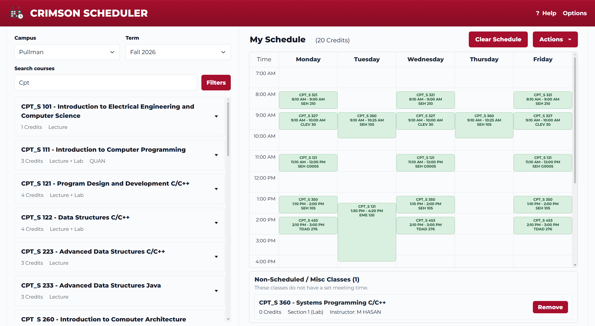
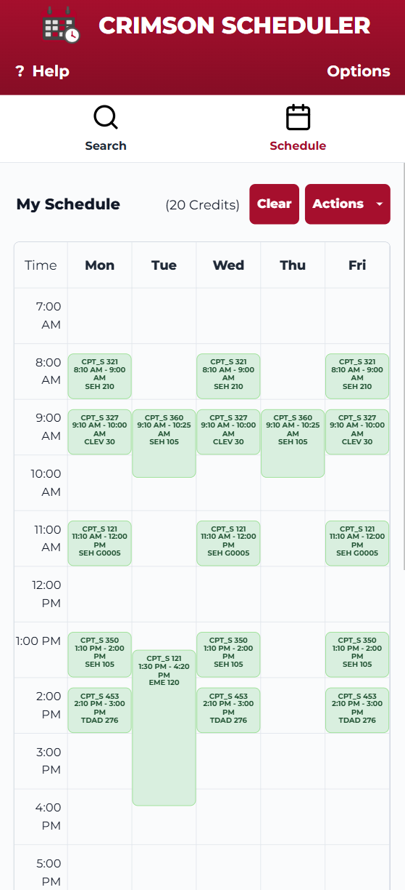
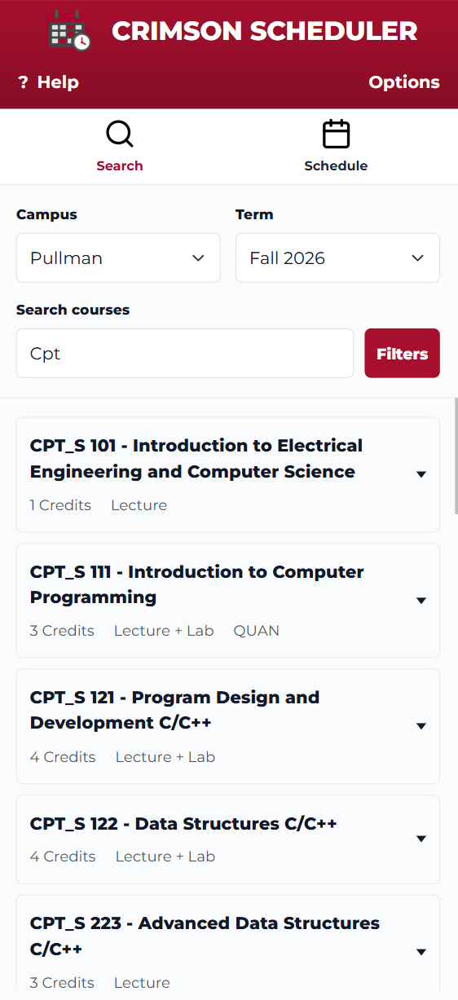

# Crimson Scheduler

Crimson Scheduler is a WSU-focused schedule builder that helps students search course offerings and create a weekly class schedule. It retrieves publicly accessible course schedule data from WSU's course API endpoints and caches them for users to query.

Users can choose a campus and term, search the published course catalog, and select sections to assemble their course schedule.



## Features

- Search courses by subject, number, course code, or title
- Load the available WSU campus/term catalog dynamically and cache a term's course data in the browser for the current visit.
- Filter results by open seats, delivery type (in person, online, or arranged), and UCORE designation.
- Review section number, meeting time, location, instructor, enrollment, and UCORE information before adding a class.
- Choose lecture and lab sections together when a course requires a lab; removing either removes the paired selection.
- Preview a section on the calendar while hovering or focusing it in the search results.
- Render classes in a weekly calendar, flag overlapping meeting times, and provide direct removal controls for conflicts.
- Keep arranged, TBA, online, and other unscheduled sections in a separate list instead of dropping them from the schedule.
- Track total credits, rename the schedule, and clear the schedule when needed.
- Export a calendar image (PNG) or a recurring `.ics` calendar file for compatible calendar apps.
- Create and import compact share codes. Imported schedules are rebuilt from the latest published course data, so unavailable sections are reported instead of silently added.
- Persist the schedule, name, display settings, and theme locally in the browser; no user account required.
- Offer responsive desktop and mobile layouts, dark mode, 24-hour time, optional weekends, instructor/section labels, accessible filter controls, and in-app guidance.

## Mobile UI

| Schedule | Search |
| --- | --- |
|  |  |

## How it works

The deployed application is a Django UI backed by a versioned, static course-data API hosted from the repository's `crimson-data` GitHub Pages branch. The browser fetches a catalog first, then retrieves only the selected campus/term JSON file. Search and filtering run client-side, which keeps normal course browsing off the Django database and avoids repeated requests to WSU while a user types.

Course data originates from WSU's public schedule endpoints. The scheduled GitHub Actions workflow regenerates the static catalog hourly and publishes it to the data branch. Section availability and other catalog details can therefore lag behind the official registration systems.

The repository still includes Django models and session-backed schedule endpoints from the earlier server-backed implementation. They are retained and covered by tests, but the primary schedule-builder flow is browser-first and uses the static catalog.

## Tech stack

- Python 3.12 and Django 5.2
- Vanilla JavaScript modules bundled with Vite
- Bootstrap, HTMX, and html2canvas for the interface and image export
- `ical-generator` for `.ics` exports
- Static JSON course catalog published through GitHub Pages
- Redis token-bucket rate limiting for Django's legacy schedule API endpoints
- PostgreSQL for Django's optional/legacy data models

## Project structure

```text
.
|-- .github/workflows/           # CI, CodeQL, and hourly course-data publication
|-- dataCollection/              # WSU API importer and JSON catalog generator
|   `-- dataHandler/
|       |-- data.py              # Requests/transforms WSU schedule data
|       |-- generate_json.py     # Builds the static API under _generated_site/
|       `-- json_storage.py      # Serializes catalog and campus/term JSON files
|-- readme-images/               # README screenshots (maintained manually)
|-- tests/                       # Vitest unit tests for browser logic
|-- web/
|   |-- classes/
|   |   |-- static/js/           # Course API client and schedule UI modules
|   |   |-- static/css/          # Responsive and theme styles
|   |   |-- templates/classes/   # Builder, help, legal, and contact pages
|   |   |-- urls.py              # App routes
|   |   `-- views.py             # Page views and catalog bootstrap
|   |-- manage.py
|   `-- web/                     # Django settings and root URL configuration
|-- package.json                 # Vite, ESLint, and Vitest commands
|-- pyproject.toml               # Python project and Ruff configuration
|-- requirements*.txt            # Runtime and development Python dependencies
|-- vercel.json                  # Production build command
`-- README.md
```

## Local development

### Prerequisites

- Python 3.12
- Node.js 20 or newer (Node 22 is used in CI)

Create and activate a virtual environment, then install Python dependencies:

```powershell
python -m venv venv
.\venv\Scripts\Activate.ps1
python -m pip install -r requirements-dev.txt
```

Install JavaScript dependencies and build the browser bundle:

```powershell
npm ci
npm run build
```

Create a `.env` file in the repository root. A SQLite configuration is enough for local development because the primary UI reads the published static catalog rather than a local course database:

```env
DJANGO_SECRET_KEY=change-this-for-local-dev
DJANGO_DEBUG=True
DJANGO_ALLOWED_HOSTS=localhost,127.0.0.1
DB_ENGINE=django.db.backends.sqlite3
DB_NAME=db.sqlite3
```

Apply migrations and start Django:

```powershell
cd web
python manage.py migrate
python manage.py runserver
```

Open `http://127.0.0.1:8000/`. The page will request the current catalog from the published API, so an internet connection is required for course search.

### Optional services and database configuration

Redis is only needed when exercising the rate-limited legacy JSON endpoints. Its defaults are `redis://127.0.0.1:6379/0` and fail-open behavior, which means a local Redis outage does not block normal development.

For PostgreSQL, set `DATABASE_URL` or the individual `DB_ENGINE`, `DB_NAME`, `DB_USER`, `DB_PWD`, `DB_HOST`, and `DB_PORT` variables. `DATABASE_URL` takes precedence. Set `REDIS_URL` and, if needed, tune `RATE_LIMIT_MAX_TOKENS`, `RATE_LIMIT_REFILL_RATE`, `RATE_LIMIT_TTL_SECONDS`, `RATE_LIMIT_TRUST_X_FORWARDED_FOR`, and `RATE_LIMIT_FAIL_OPEN`.

### Refreshing the static course API locally

The production catalog is generated by GitHub Actions. To generate the same static API locally:

```powershell
python -m dataCollection.dataHandler.generate_json
```

This writes `_generated_site/api/v1/catalog.json` plus one JSON file per campus/term. The script requests WSU's public schedule API and may take time depending on the number of active terms and subjects. It does not update the local Django database.

The older database importer remains available as `python main.py`; it initializes Django and imports the WSU data into the configured database. It is useful for maintaining the legacy endpoints, not required for the browser-based builder.

## Quality checks

```powershell
npm run lint
npm test
python -m ruff check .
python -m ruff format --check .
cd web
python manage.py check
python manage.py test
```

GitHub Actions runs Python and JavaScript linting, Django checks/tests, Vitest, CodeQL analysis, and the hourly data-publication workflow.

## Routes

| Route | Purpose |
| --- | --- |
| `/` | Schedule builder |
| `/privacy-policy/` | Privacy policy |
| `/terms-of-service/` | Terms of service |
| `/contact/` | Contact and feedback guidance |
| `/admin/` | Django administration |
| `/api/schedule-data/` | Legacy session schedule data |
| `/api/sections-by-ids/` | Legacy section lookup endpoint |

## Privacy and data notes

Schedules, display preferences, schedule names, and theme selection are stored in the browser's local storage. A legacy cookie reader is retained for older schedules, but the current builder persists new schedules in local storage. Share codes encode a schedule name and campus/term section identifiers; they are not stored on the server.

The site uses Vercel Web Analytics for aggregate traffic information. Consult the in-app [Privacy Policy](/privacy-policy/) for the current details.

## Future work

- [ ] Deploy and maintain the public production experience.
- [x] Add image and calendar export.
- [x] Add share/import codes.
- [x] Add client-side availability, delivery, and UCORE filters.
- [ ] Explore reliable instructor-rating links or a user-submitted rating system.
- [ ] Improve visibility into how fresh enrollment counts are after each catalog refresh.
- [ ] Add course descriptions, prerequisites, and degree-planning relationships when reliable source data is available.
- [ ] Visualize walking routes between class locations.

## Disclaimer

Crimson Scheduler is an independent third-party project. It is not affiliated with, endorsed by, sponsored by, or otherwise officially associated with Washington State University.

It is a planning tool, not a registration system. Always verify course availability, meeting times, instructors, locations, prerequisites, and registration requirements through official WSU resources before enrolling.

## License

[MIT](LICENSE.md)
